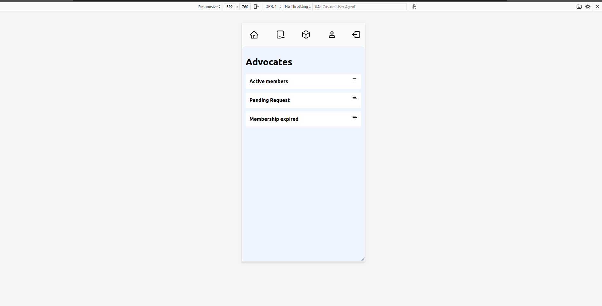
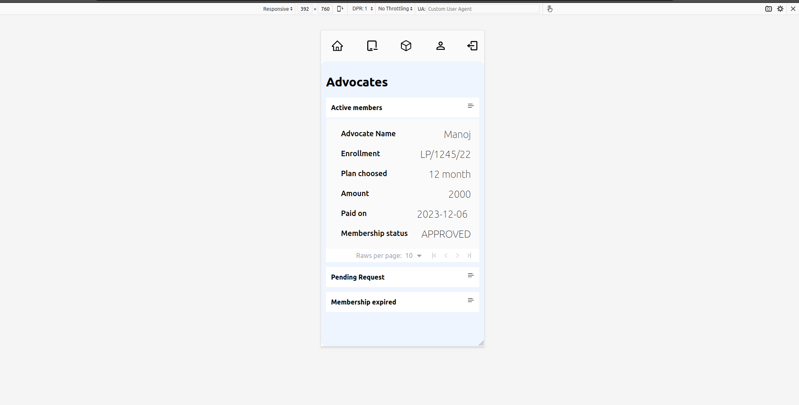
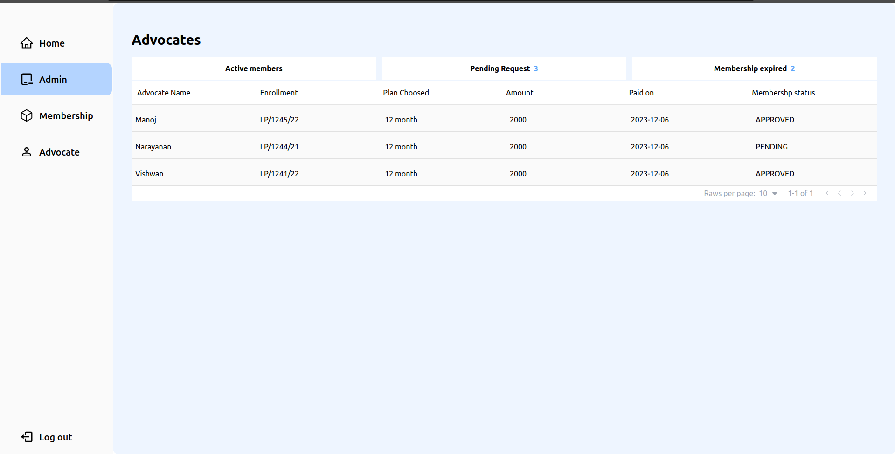

Hello 👋🏻,
This is just a responsive single page created using React Library.
Responsive to Mobile and Laptop breakpoints.
Tailwind css is used for styling the pages

Mobile view 1

Mobile view 2

Laptop view 1

vite is used for development

all files are inside the src folder.
folders
-components => all components are created inside this folder
-DataFetching => Dummy data is created, and exported for further use
-assets => no assets are used

Styling is all done using Tailwind Css 😉. (This might seem so disguesting , but sometimes we need to use this for boost our production speed)

No sperate folder is created for custom css files. Only three of them are there!
